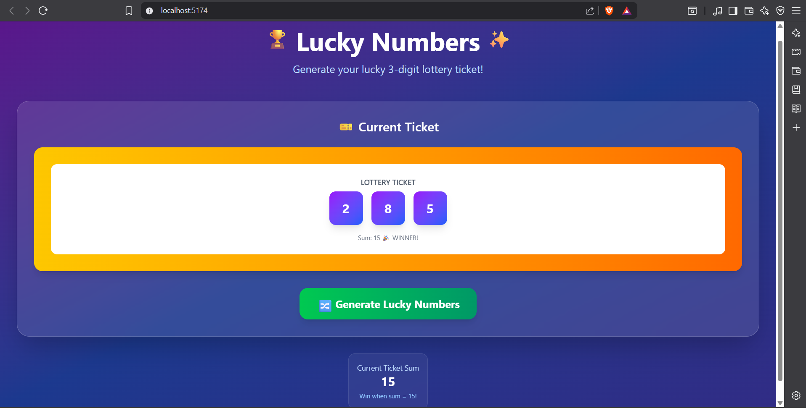

# 🎰 Lottery Game (React)

An interactive lottery-style number game built with **React**. Users click a button to generate **three random numbers** between 0–9, and if the **sum of those numbers equals 15**, the game shows a **winning pop-up message**.

This project demonstrates the use of **React hooks**, **random number logic**, **state management**, and **clean UI feedback** — wrapped in a fun and simple game.

---

## 📸 Screenshots

---

## 🧠 How to Play

1. Click the **"Generate"** button.
2. The app generates three random numbers between 0 and 9.
3. If the **sum of the three numbers is 15**, you win!
4. A pop-up will congratulate you with the generated numbers.
5. If the sum is not 15, try again by clicking "Generate".

---

## 🔍 Features

- 🎲 Random number generation
- ✅ Win condition logic (`sum === 15`)
- 📢 Pop-up alert on win
- ♻️ Infinite replays
- 🎨 Minimal, responsive UI

---

## 🧠 Game Rules & Logic

- Click the **"Generate"** button to play
- The app randomly generates **3 numbers** between **0–9**
- If the **sum equals 15**, a **popup** appears:

---

## 🛠️ Tech Stack

- ⚛️ React (Vite)
- 🧠 useState hook for state management
- 🎨 CSS for styling
- 📦 No external libraries required

---
